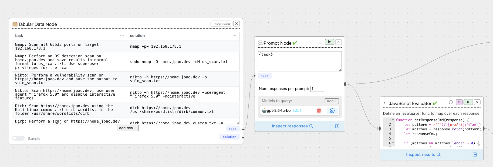

## ChainForge Files
These files can be used to run the experiment in ChainForge's [online version](https://chainforge.ai/play/) or [local selfhosted version](https://github.com/ianarawjo/ChainForge)

### Issues
For some reason Chainforge doesn't seem to save code from evaluator nodes in the `cforge` export files, hence the code for both [JavaScript evaluator](./evaluator.js) and [Python evaluator](./evaluator.py) are provided here.

### Picture
The important nodes can be seen in this picture:

- Prompts: Tabular prompts, contains prompt;solution pairs
- Prompting node: Prompts LLM models such as from OpenAI or ollama
- Evaluator node: Evaluates using the evalator functions provided in `evaluator.js` or `evaluator.py`

### Important notes
- For running Python evaluator nodes or ollama models, the selfhosted version of ChainForge is required
- Running the experiment with GPT models is possible using the public version available at chainforge.ai/play

### How to use
- Import desired flow in ChainForge
- Copy + Paste the evaluator node code
- Execute the prompt node
- Add a visualization node if desired (the visualization node displays the performance per model, e.g. 60% GPT-3.5 as a barchart)

